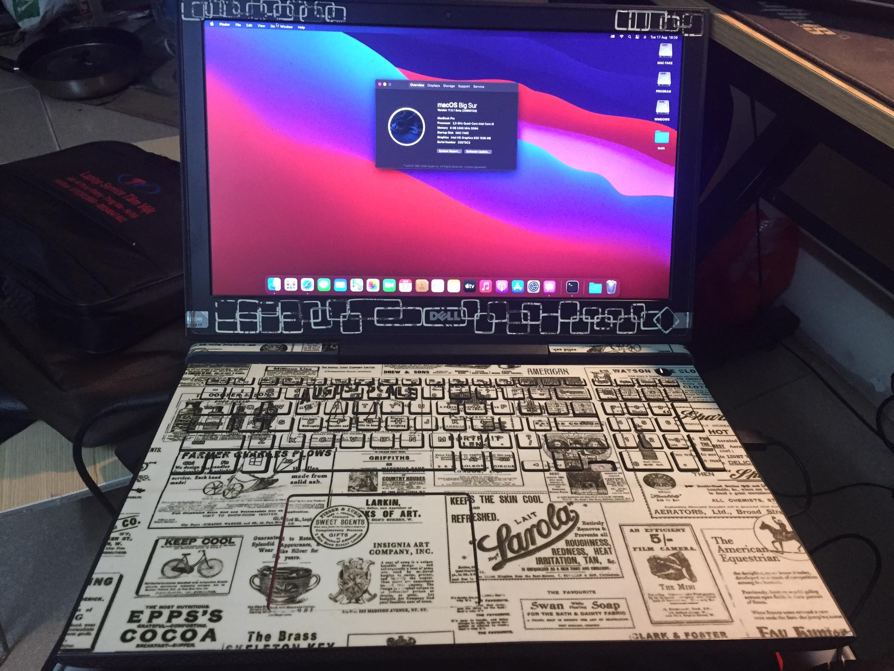

# Copied Hackintosh Guide/ Dell 7567

### Screenshot



### Notes
 - HDMI không hoạt động vì nó được gắn trực tiếp với NVIDIA GTX1050ti

### Những lỗi đã biết :
 - 2.1 audio (2.0 works)
 - Bluetooth không hoạt động với một vài thiết bị

### Cấu hình :
 - Intel i5-7300HQ CPU
 - Intel HD Graphics 630 / nVidia GTX 1050 Ti
 - 8GB 2400MHz DDR4 RAM
 - 15.6” 1080p IPS Display
 - 120 GB SSD (m2 sata)
 - 500 GB 5400RPM HDD

### Cài đặt Bios
 - Set BIOS options properly:
   - Disable Legacy Option ROMs
   - Change SATA operation to AHCI (If already using windows, google how to)
   - Disable Secure Boot
   - Disable SGX

# Tạo bộ cài

## Tạo bộ cài trên MacOS

- Tải xuống bộ cài MacOS Big Sur từ các nguồn, đuôi dmg.
- Vất vào Applications rồi làm theo hướng dẫn tạo bộ cài lên USB bằng bài viết này:
https://blogchiasekienthuc.com/hackintosh/tao-usb-cai-hackintosh-voi-clover-bootloader.html


## Tạo bộ cài trên Windows

- Tải xuống bộ cài MacOS Big Sur từ các nguồn, đuôi raw.
- Dùng thằng Etcher hoặc Win32 Disk Imager để ghi lên USB.
- Cá nhân mình dùng Etcher vì nó dễ dùng giao diện đẹp.


## Chuẩn bị EFI trên ổ cứng để boot vào bộ cài từ USB

- Dùng win pe và sử dụng công cụ minitool partition wizard 12.
- Ổ cứng để địng dạng GPT
- Tạo phân vùng FAT32 tên EFI MAC = 210 MB
- Chuyển phân vùng thành EFI partition rồi Apply
- Copy toàn bộ EFI trên Github vào phân vùng vừa tạo.
- Tạo phân vùng NTFS, phân vùng này để Earse trong Disk Utility để cài Mac lên đây.

  
## Install

- Khởi động máy vào boot option bằng F12
- Chọn UEFI phân vùng ở bước trên chúng ta tạo.
- Vào được Opencore - chọn bộ cài từ USB và làm tiếp các bước cài đặt.


**Cài đặt ComboJack fix Headphone Jack**
  - Mở terminal
  - cd đến thư mục chứa thư mục ComboJack_Installer
  - Run ComboJack_Installer/install.sh
  - Reboot  
  
**To Do List and Things to Consider**
- Config file does not include SMBIOS parameters which is a must. One needs to provide own values. There are guides here and there. Your friend is google as always. For ROM adress you can use your builtin ethernet card MAC adress. MacSerial by Acidanthera is a good way to obtain proper serial and motherboard serial numbers. UUID can be generated with terminal command uuidgen. Make it produced at least five times to be sure it is unique enough. For working imessage and facetime all should be set in a sensible way and make sure that they are not used by someone else either hackintosh or real mac.
- USBMap.kext is set to Macbookpro14,1. If you want to use a different SMBIOS you should also change the correspond model name in the info.plist inside the kext. Fingerprint device is closed to save battery and avoid long waiting before root access. it does not work anyway for now because apple does not allow to use third party ones.

**Disable Hibernation**
```bash
sudo pmset -a hibernatemode 0
sudo rm /var/vm/sleepimage
sudo mkdir /var/vm/sleepimage
sudo pmset -a standby 0
sudo pmset -a autopoweroff 0
sudo pmset -a powernap 0
```

## Credits
 - [Lersy](https://github.com/lersy) and (https://www.github.com/maxis7567/)

